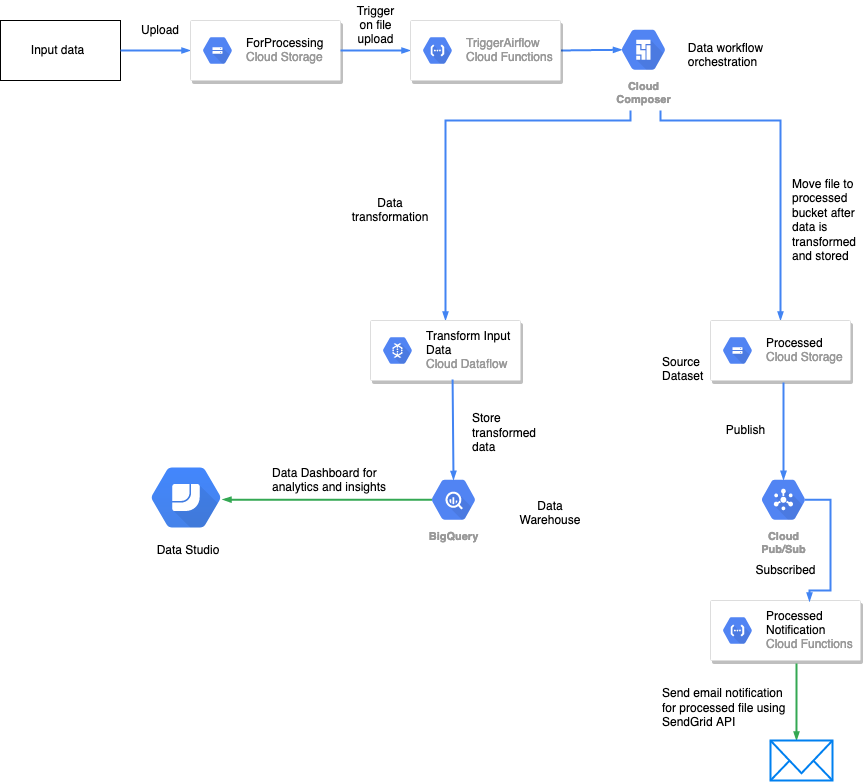

# Data Pipeline to process New York City 311 Service Requests

## Dataset:
[NY 311 Service Requests](https://data.cityofnewyork.us/Social-Services/311-Service-Requests-from-2010-to-Present/erm2-nwe9) is hosted by the City of New York. NYC311’s mission is to provide the public with quick, easy access to all New York City government services and information while offering the best customer service.

The csv dataset is over 10 GB.

## Pipeline
The Pipeline use `Google Cloud Platform` services to process the dataset in efficient and scalable way!



The pipeline consists of:
- Two `Cloud Storage` buckets
    - Processing Bucket which will trigger the start of the pipeline
    - Processed Bucket which will have two folders, one for failure and one for success
- Two `Cloud Functions`
    - The first one will be triggered when dataset is put in Processing Bucket (filename: [cloud_function_trigger.py](cloud_function_trigger.py))
    - The second will send email notification using `SendGrid` when message if pushed to `Cloud Pub/Sub` topic (filename: [send_email_notification.py](send_email_notification.py))
- `Cloud Composer` environement that is the core of the pipeline and which starts `Cloud Dataflow` job for processing the dataset
    - Airflow dag file is [airflow.py](airflow.py)
    - Dataflow file is [process_csv_files.py](process_csv_files.py), should put in composer bucket dag folder inside a dataflow folder
- `Cloud Pub/Sub` topic for email notification, which will trigger the second cloud function
- `BigQuery` used as Data Warehouse, dataflow job writes the processed data to BigQuery table


Airflow variables to be set:
```
gcs_completion_bucket -> Processed bucket name

gcp_temp_location -> For data flow, set some bucket location

gcp_project -> Project name

pubsub_topic_email -> Pub/Sub Topic name that will trigger second cloud function

bq_output_table -> BigQuery table name


input_field_names -> unique_key,created_date,closed_date,agency,agency_name,complaint_type,descriptor,location_type,incident_zip,incident_address,street_name,cross_street_1,cross_street_2,intersection_street_1,intersection_street_2,address_type,city,landmark,facility_type,status,due_date,resolution_description,resolution_action_updated_date,community_board,bbl,borough,x_coordinate_state_plane,y_coordinate_state_plane,open_data_channel_type,park_facility_name,park_borough,vehicle_type,taxi_company_borough,taxi_pick_up_location,bridge_highway_name,bridge_highway_direction,road_ramp,bridge_highway_segment,latitude,longitude,location
```

## Triggering the pipeline

Just drop csv dataset in the Processing bucket and we are good to go!
You can use the resulting BigQuery table to gain valuable insights from the 311 service requests about New York City like what is the Noisest Residential street in New York City. (it is EAST 231 STREET according to the complaints recieved)
